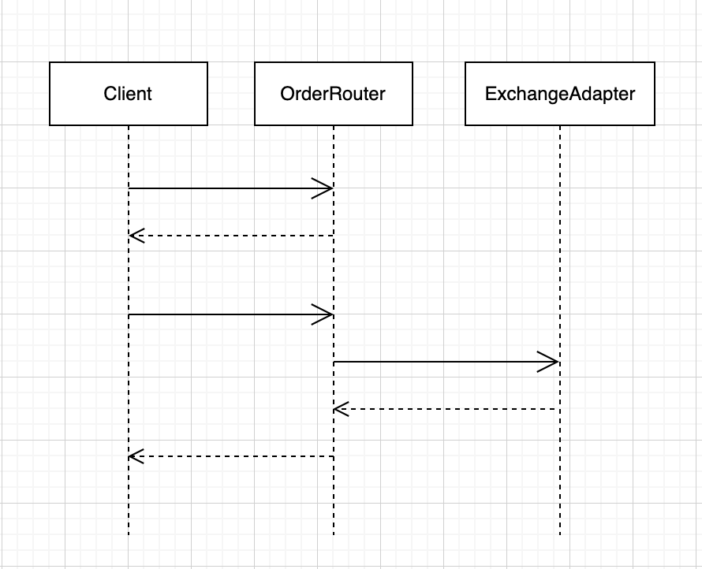

# market-access

A super tiny module to demonstrate [Service Choreography](https://en.wikipedia.org/wiki/Service_choreography) pattern using [Vert.x](https://vertx.io/) toolkit.

All the service components talk to each other asynchronously. A brief description of service components,

- Client - Junit tests
- OrderRouter - gateway component, applies some business logic
- ExchangeAdapter - acts like an exchange simulator 